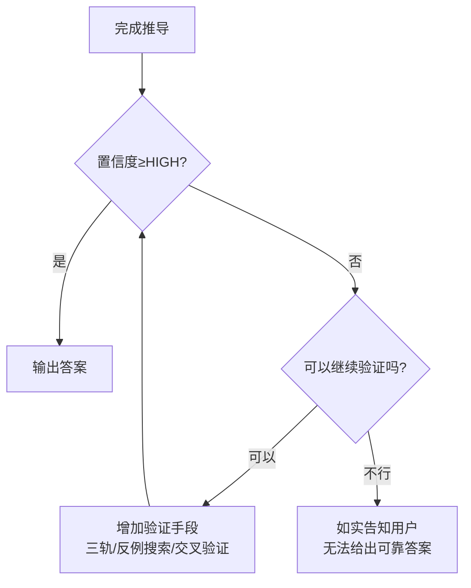

# 数学解答输出格式规范

## 语言偏好

**该用户要求使用简体中文**（非繁体中文）。所有数学输出、教学材料、公式说明、代码注释均使用简体中文。不主动使用「你」「您」等称呼，直接陈述内容。

## 教学风格偏好

**该用户拒绝聊天式教学**（"别这样教我"）。用户要求：
- 先出完整大纲确认，再逐章输出成 LaTeX 文件
- 不使用「小明有 3 个苹果」式的故事化教学
- 用成年人的方式讲——"不解释苹果和鸭梨，永远解释为什么"
- **内容必须足够详细**——不要假设用户学过任何数学知识，每一个概念从最底层讲起
- **每个数学符号第一次出现时标注读法**——比如 \(10^2\) 读作「10的2次方」、\(\times\) 读作「乘」、\(\sum\) 读作「西格玛求和」
- **练习必须附答案和完整解析**——答案集中放在附录章节，不内联在题后。每道题标注 "（答案见附录 \ref{ans:chXX}）" 供跳转

## LaTeX 教材制作模式

当用户要求系统性地学习数学（"从最基础开始教"），触发此模式。

**教学水平定位**：用户可能自评「数学太烂」「学到初三就忘了」。必须从最底层开始，不假设任何先验知识。每个概念出现时，假设用户是第一次遇到它。

### 工作流

1. **设计大纲** — 先输出完整大纲（.md 文件），让用户确认结构和范围
2. **搭建环境** — 安装 TinyTeX（无需 sudo），配置 xelatex + ctex 中文支持
3. **创建主文件** — `book.tex` 作为根文件，`\include` 各章
4. **逐章编写** — 每章一个独立 .tex 文件，按统一模板编写
5. **编译验证** — 两遍 xelatex 确保目录生成
6. **交付 PDF** — 将生成的 book.pdf 提供给用户

### 多编教材的螺旋上升结构

当教材包含多个编（part）时，编与编之间需要逻辑递进而非简单并列。用户反馈要求「更加紧凑、过渡要更加自然、深度要提升」。

**递进设计原则：**

1. **每编以「上一编的局限」为起点**。例如第二编从第一编的局限出发——第一编处理的是「已知数的运算」，第二编处理的是「未知数的推理」。每章末尾用 2~3 句自然引出下一章问题。

2. **螺旋上升对照表**：同一个概念在不同章节以不同深度反复出现。用对照表展示深度递进：

   ```
   | 概念 | 第8章（出现） | 第9章（深化） | 第10章（扩展） |
   | 分配律 | 合并同类项 | 解方程去括号 | 解不等式 |
   | 负数 | 负号去括号 | 两边乘除负数 | ⚠️乘负数要变号 |
   | 解的数量 | 字母代任意值 | 唯一解 | 范围解 |
   ```

3. **三章关系模板**（工具准备→工具使用→工具扩展）：

### 章节模板（含信心设计）

每章 .tex 文件的结构：

每章 .tex 文件的结构：

```latex
\chapter{章标题——副标题}

\section{问题}
（从一个具体的、反直觉的问题出发，引出本章概念）

\section{本质}
（一句话说清这个数学概念的核心是什么）

\section{定义}
（精确的数学定义，用 LaTeX 公式表达）

\section{性质/推导}
（从定义推导出的重要性质，每个列出一条）

\section{代码验证}
（Python 代码块，用实际计算验证数学结论）

\\section{练习}
（exercise 环境，6~8 道题，前 2~3 道为基础题，后 3~5 道为综合题）
（答案不在此处，统一放在附录 \\ref{ans:chXX}）

\\\\subsection*{💪 进步宣言}
（彩色方框，用「之前只能……现在能……」对比展示能力跃迁，详见下方「信心设计模式」节）

\\\\section{本章小结}
（回顾核心知识点，预告下一章内容）
```

### 信心设计模式——进步宣言彩框

每章末尾用 `\\subsection*{💪 进步宣言}` + `\\fcolorbox` 制造「之前只能……现在能……」的明确进步对比，让学习者清晰感知能力跃迁。模板：

```latex
\\subsection*{💪 进步宣言}

\\begin{center}
\\fcolorbox{blue!40}{blue!5}{\\parbox{0.85\\textwidth}{\\centering\\Large
\\textbf{之前你只能……（旧能力的描述）}\\\\[6pt]
\\textbf{现在你能……（新能力的描述）}\\\\[6pt]
\\textbf{（跃迁的定性总结——如一维到二维、静态到动态、工具到思想）}
}}
\\end{center}
```

### 图绘制策略抉择：手写 TikZ vs Python + matplotlib

**决策规则：**
- 带坐标轴的函数图 → Python + matplotlib 矢量 PDF（刻度、标注、多线交点在 Python 中可控，手写 TikZ 容易造成叠字/标错）
- 有角度弧线的几何图 → Python + matplotlib（Arc 的起始/终止角度更容易算对）
- 多层标注/颜色区分 → Python + matplotlib
- 极简单的无坐标图（箭头示意、长方形分割、天平模型） → 手写 TikZ

详见 `latex-figure-drawing` skill 中的完整模板和参考实现。

### TikZ 图排版规范（本 session 三次用户纠错后验证的规则集）

本 session 中第12章的 TikZ 图被用户三次指出拥挤/看不清。以下规则可防止同类问题复发。已去重（合并了重复出现的两组规则）。

#### 规则1：坐标轴刻度字体用 `\scriptsize`

所有 `\foreach \x in {...} \draw (\x,0.06) -- (\x,-0.06) node[below,font=\scriptsize] {\x};` 中的刻度数字字体必须显式设为 `\scriptsize`（比 `\footnotesize` 再小一级），避免刻度数字与图内标注重叠。

#### 规则2：Δx 标注放在坐标轴上方，不与刻度抢下方空间

```latex
% ❌ 错误（Δx 在 x 轴下方，与刻度重叠）：
\draw[<->,blue,thick] (1,0) -- (2,0) node[midway,below] {\( \Delta x = 1 \)};

% ✅ 正确（Δx 在 x 轴上方，刻度占下方）：
\draw[<->,blue,thick] (1,0) -- (2,0) node[midway,above,font=\scriptsize] {\( \Delta x = 1 \)};
```

#### 规则3：Δy 标注用 `pos=0.65` + `xshift=4pt` 避免与箭头线重叠

```latex
% ❌ 错误（文字紧贴箭头线，被挡住）：
\draw[<->,blue,thick] (2,0) -- (2,2) node[midway,right] {\( \Delta y = 2 \)};

% ✅ 正确（偏下 + 右移，远离箭头线）：
\draw[<->,blue,thick] (2,0) -- (2,2) node[pos=0.65,right,font=\scriptsize,xshift=4pt] {\( \Delta y = 2 \)};
```

`pos=0.65` 将标注放在箭头从起点算 65% 的位置（偏下），`xshift=4pt` 将文字右移 4 个点。两个参数组合使用，确保文字与箭头线之间有可见间隙。对正 Δy（向上箭头）和负 Δy（向下箭头）同样有效。

#### 规则4：不用 `[below]` / `[above]` 锚点，用精确坐标 + `align=center`

```latex
% ❌ 错误（文字挤在一起）：
\node[below] at (-3.5,-0.2) {第8章：已知 x，求值};

% ✅ 正确（精确坐标，不会重叠）：
\node[align=center] at (-3.2,0.5) {\small 第8章：已知 \( x \)，求值};
\node[blue,align=center] at (-3.2,-0.5) {\small \( x=5 \to 3\times5+5=20 \)};
```

原因：`[below]` 以指定坐标为文字顶部，文字向下延伸，当多个 `[below]` 节点在垂直方向上相邻时，文字底部会互相重叠。用 `align=center` + 精确 y 坐标可以完全控制文字位置。

#### 规则5：数轴/不等式图用三层分离布局

数轴上的不等式图应使用三层布局，将箭头、轴线、标注文字分开放置，避免任何两层重叠：

```
y = +0.35  → 第一层条件（红/蓝色箭头 + 空心圈/实心点）
y =  0     → 数轴线 + 解集粗线（绿色/蓝色，line width=4pt，两端加小圆点标记边界）
y = -0.35  → 第二层条件（另一色箭头 + 空心圈/实心点）
y = -0.7   → 条件标注文字
```

**正确的布局示例（不等式组交集图）：**
```latex
\draw[red,thick,->] (2.2,0.35) -- (6.5,0.35);  % 条件1在上层
\draw[blue,thick,<-] (4.8,-0.35) -- (0.5,-0.35);  % 条件2在下层
\draw[green!60!black,thick,line width=4pt] (2.2,0) -- (4.8,0);  % 交集在轴线上
\draw[green!60!black,fill] (2.2,0) circle (0.03);  % 端点标记
\draw[green!60!black,fill] (4.8,0) circle (0.03);
\node[green!60!black,below] at (3.5,-0.7) {\( 2 < x < 5 \)};
```

解集粗线画在轴线 y=0 上（用 `line width=4pt` 与轴线区分），粗线两端加小圆点标记边界。

#### 规则6：空心圈和实心点用显式形状

```latex
% 空心圈（不含边界）
\draw[red] (2,0.35) circle (0.05);
\node[red] at (2,0.35) {\(\circ\)};  % 确保圈可见

% 实心点（含边界）
\draw[red,fill] (4,-0.35) circle (0.08);
```

#### 规则7：直线与水平线交点的画法（方程解的几何意义）

```latex
% 直线
\draw[red,thick] (-0.5,0) -- (3,7);
% 水平线（虚线）
\draw[blue,thick,dashed] (-0.5,5) -- (4,5);
% 交点（绿色实心圆）
\filldraw[green!60!black] (2,5) circle (0.1);
% 从交点向坐标轴引辅助线
\draw[->,green!60!black,thin] (2,5) -- (2,0);
\draw[->,green!60!black,thin] (2,5) -- (0,5);
\node[green!60!black,below,font=\scriptsize] at (2,-0.3) {\( x=2 \)};
```

### 系列多卷本教材架构

当教材超过 10 章、分属多个编时，拆分为独立卷本（上/中/下册），每卷独立目录：

```
~/math-notes-shangce/       ← 上册独立目录
├── book.tex                ← 独立主文件
├── compile.sh
├── shared/preamble.tex     ← 样式文件（各卷复制以保持一致）
├── part1/ part2/ ...
├── appendix/answers.tex
└── book.pdf

~/math-notes-zhongce/       ← 中册独立目录（结构同上）
```

**卷间衔接：** 每卷以回顾上一卷终点为开头；卷末设「下册预告」页；各卷共享同一 `preamble.tex`（复制）保证风格一致。

**教学原则——「先问题，再本质，后定义」**（用户明确称赞过「内容质量非常高，不仅教学还引导学习者思考」「层层递进，逻辑清晰」）：
1. 不要从干燥的定义开始——先抛出一个**反直觉的具体问题**（如"为什么 23+19 不等于 312？""为什么 0.1+0.2≠0.3？""1÷3 算不完怎么办？"）
2. 让用户产生认知冲突——"这和我以为的不一样"
3. 再解释本质——用一句话说清核心思想
4. 最后才是正式定义——此时定义是回答前面问题的自然结论，而不是凭空出现的
5. 用好**数形结合**——用户称赞过"数形结合方便理解"。用 tikz 画数轴、长方形分割、坐标系等示意图，辅助文字推导

### 章节编写要点

1. **每个符号首次出现时标注读法**：\(=\), \(+\), \(-), \(\times\), \(\div\), \(10^2\)（读作"10的2次方"），\(\sum\)（读作"西格玛"），\(\sqrt{}\)（读作"根号"），\(d_i\)（读作"d下标i"），\(\cdots\)（读作"等等"），\(\Longleftrightarrow\)（读作"等价于"），\(\neq\)（读作"不等于"）等。用括号或粗体标记。**不要假设用户认识任何符号。** 用户反馈过"有些符号我都不会读"。

1.5 **同济版高数排版风格**：教材排版参照同济版《高等数学》风格——公式按节编号 `\numberwithin{equation}{section}`、定理标题加粗正体（非斜体）、证明环境以"证"开头末尾 □、页眉左章右节。具体配置见 preamble 节。

2. **内容深度要求（极端详细）**：
   - 不要跳步——任何代数计算至少展示 3~5 个中间步骤
   - 每一步标注变化原因（"两边同时加 5""合并同类项""提取公因数"）
   - 假设用户零基础——不要假设"这个显然""这个上一步讲过了"
   - 宁可啰嗦也不要省略——信息密度低比看不懂好
   - 每个新概念要先给直观例子，再给表格/对照，最后给正式定义

3. **定理环境带颜色**——用户要求像高质量数学书一样用颜色区分：
   - 定义（定义框标题为蓝色 `\color{blue!60!black}`）
   - 定理（标题红色 `\color{red!60!black}`，内容斜体）
   - 命题（标题青绿 `\color{teal!70!black}`）
   - 猜想（标题橙色 `\color{orange!70!black}`）
   - 例（标题紫色 `\color{purple!60!black}`）
   - 练习（黑色加粗）

   实现方式（preamble.tex中）：
   ```latex
   \newtheoremstyle{defstyle}
     {3pt}{3pt}{}{}{\color{blue!60!black}\bfseries}{.}{.5em}{}
   \newtheoremstyle{thmstyle}
     {3pt}{3pt}{\itshape}{}{\color{red!60!black}\bfseries}{.}{.5em}{}
   \newtheoremstyle{propstyle}
     {3pt}{3pt}{}{}{\color{teal!70!black}\bfseries}{.}{.5em}{}
   \newtheoremstyle{conjstyle}
     {3pt}{3pt}{}{}{\color{orange!70!black}\bfseries}{.}{.5em}{}
   \newtheoremstyle{exstyle}
     {3pt}{3pt}{}{}{\color{purple!60!black}\bfseries}{.}{.5em}{}
   \newtheoremstyle{exerstyle}
     {3pt}{3pt}{}{}{\bfseries}{.}{.5em}{}

   \theoremstyle{defstyle}
   \newtheorem{definition}{定义}[chapter]
   \theoremstyle{thmstyle}
   \newtheorem{theorem}{定理}[chapter]
   \theoremstyle{propstyle}
   \newtheorem{proposition}{命题}[chapter]
   \theoremstyle{conjstyle}
   \newtheorem{conjecture}{猜想}[chapter]
   \theoremstyle{exstyle}
   \newtheorem{example}{例}[chapter]
   \theoremstyle{exerstyle}
   \newtheorem{exercise}{练习}[chapter]
   ```

4. **正式定义框（\texttt{\begin{definition}}）必须保留**：
   - 每个核心概念必须有一个形式化的定义框（`\begin{definition}...\end{definition}`）
   - ⚠️ **定义了就不能删**。用户明确反馈过"之前有定义，我觉得挺好的。现在没了，能补回去吗"——删定义框是严重的倒退。即使在重写/简化内容时，定义框也必须保留。
   - 定义框不孤立存在——紧跟"符号说明"小节（列出定义中每个符号的读法和含义），再跟一个具体例子套进定义演示。
   - 定义框在 LaTeX 源码中使用 `\newtheorem{definition}{定义}[chapter]` 创建。

5. **数位表/对照表**：涉及位值、进制、单位换算时，先用表格列出完整关系，再举例。

6. **使用 ctexbook 文档类**（自动处理中文排版、字体、章节编号）：
   - 用 `\include` 而不是 `\input`（方便独立编译每章）
   - 主文件 book.tex 结构：frontmatter（标题+目录）→ mainmatter（各章）→ appendix（答案）

7. **练习答案放在附录**，不在章内：
   - 附录文件 `appendix/answers.tex`，用 `\chapter{练习题答案}` 作为章节
   - 每章一个 `\section`，用 `\label{ans:chXX}` 标记
   - 练习内用 `（答案见附录 \ref{ans:chXX}）` 引用
   - 答案要写出完整解析步骤，不能只给最终结果
   - 解析中使用 `\checkmark`（✅）和 `\times`（❌）标记判断正误

8. **练习设计原则**——用户反馈"基础题可以多出几题，给学习者提升熟练度"：
   - 每章练习按难度分层：先出 2~3 道基础题（模仿例题、直接套定义），再出 3~5 道综合题（需多步推理）
   - 基础题示例：写出十位和个位、直接写出运算顺序结果、把乘法写成加法形式
   - 综合题示例：证明两位数交换性质、解释为什么除以零没意义
   - 在 .tex 中基础题排前面，综合题排后面

9. **代码验证**：Python 代码中每个关键步骤加注释说明。代码输出结果要展示在代码块下方。

10. **「精美」排版技术**（用户对第9章明确要求「要更加精美一些」后验证有效的技术集合）：

    a. **TikZ 示意图**：用简单的 tikz 图辅助理解抽象概念，不要复杂到编译爆炸（不超过 10 条路径，无嵌套 ifnum）。
       - 天平模型（表示等式两边平衡）：左右托盘 + 中间等号，标注具体表达式
       - 数轴图（表示不等式的解集范围）：箭头线 + 刻度 + 实心点/空心圈 + 颜色标识
       - 对比箭头图（表示「正向 vs 逆向推理」）：两条反向箭头线 + 标注文字
       - 数轴推导图（演示乘负数变号）：用上下两层箭头标注「2<4 → -2>-4」
       - 不等式组交集图：两条不同色箭头 + 绿色粗线标交集

    b. **分步对齐标注**：在 `aligned` 环境中，每行末尾用 `\quad &\text{操作说明}` 标注当前步骤做了什么：
       ```latex
       \begin{aligned}
       3x + 5 &= 20 \\
       3x &= 20 - 5 \quad &\text{移常数项} \\
       3x &= 15 \\
       x &= 15 \div 3 \quad &\text{除以系数} \\
       x &= 5
       \end{aligned}
       ```

    c. **颜色高亮运算操作**：用 `\textcolor{red}{}` 标注当前步骤中发生变化的操作对象：
       ```latex
       3x + 5 \textcolor{red}{- 5} &= 20 \textcolor{red}{- 5} \quad &\text{两边同时减 5}
       ```
       红色标记让读者一眼看到「发生了什么变化」。

    d. **彩框强调关键规则**：用 `\fcolorbox{color}{bgcolor}{\parbox{...}{...}}` 制作醒目提示框：
       ```latex
       \fcolorbox{red!30}{red!10}{\parbox{0.85\textwidth}{\textbf{黄金法则：解完方程后，一定把 \( x \) 代回原方程检验。}}}
       ```

    e. **对比表**：当有多个同类项需要对比时，用 `array` 制作表格：
       ```latex
       \[
       \begin{array}{c|c|c}
       \text{类型} & \text{例子} & \text{解法要点} \\
       \hline
       \text{标准型} & 4x+7=31 & \text{移常数→除以系数} \\
       \text{去括号型} & 3(x+2)=21 & \text{先去括号，再标准化} \\
       \text{去分母型} & \frac{x}{2}+\frac{x}{3}=5 & \text{两边乘 LCM}
       \end{array}
       \]

    f. **公式排版要点**：涉及分数、除法的步骤尽量用 `aligned` 展开，不写成一整行；每个步骤标注「原因」而非只标注「操作」（用「两边同时加 5」而不是「移项」）。

11. **排版视觉陷阱**（用户反馈过）：数字后紧跟中文括号 `（` 会在 PDF 中造成视觉粘连。例如 `600（6` 看起来像 `6006`。解决方案：将数字用数学模式包裹 `\\( 600 \\)（说明...）`，或在数字和括号间加空格。全局排查命令：`grep -n '\\d（' *.tex`。

11. **LaTeX 常见编译错误**（本 session 发现并修复过的）：

    - **tikz 嵌套 `\\ifnum` 超限**：在高密度 tikz 图中（如 1~100 质数筛法图），使用 27 层嵌套 `\\ifnum...\\else\\ifnum...\\fi\\fi\\fi...` 会导致 TeX 报 `! Extra \\fi.` 并累积到 100 个错误后停止编译。修复方案：用纯文本的 `array` 表格代替 tikz 图，或用 `\\foreach` + `\\pgfmathisprime` 等计算方式代替硬编码 ifnum 链。

    - **`\\TODO{中文}` 引发 `! Missing $ inserted`**：`\\newcommand{\\TODO}[1]{\\textcolor{red}{[TODO: #1]}}` 中的中文参数（如 `\\TODO{待编写}`）在某些上下文（如空章节的 `\\chapter` 后直接使用）会触发 `! Missing $ inserted` 和 `! You can't use \\spacefactor in vertical mode` 等错误。修复：写空的待编章节时，用 `% 注释` 代替 `\\TODO{}`，或确保 `\\TODO` 在段落模式（非垂直模式）下调用。

12. **章节占位文件的正确处理**：当书中有未写的章节时，需要用 `\\include{}` 引入占位文件。占位文件不能有编译错误，也不能含有 `\\TODO{中文}`。推荐格式：
    ```latex
    % 第9章：一元一次方程（占位——待编写）
    \\chapter{一元一次方程——从正向计算到逆向推理}
    % 待编写内容：等式的性质、移项、去分母、应用题
    ```

```bash
# 安装 TinyTeX（无需 sudo，装在用户目录）
curl -sL "https://yihui.org/gh/tinytex/tools/install-unx.sh" | sh

# 添加到 PATH
export PATH="$HOME/Library/TinyTeX/bin/universal-darwin:$PATH"

# 安装中文支持
tlmgr install ctex

# 可能还需要切换镜像（墙内）
tlmgr option repository https://mirrors.tuna.tsinghua.edu.cn/CTAN/systems/texlive/tlnet/

# 编译
xelatex -interaction=nonstopmode book.tex
# 需要编译两遍以生成目录
```

## Markdown 中 LaTeX 定界符规则

| 场景 | 定界符 | 示例 |
|------|--------|------|
| **行内公式** | `\( \)` | `\( f(x) = \frac{x^2}{4} + \frac{y^2}{3} \)` |
| **独行公式** | `$$ $$` | `$$ \int_a^b f(x)\,dx $$` |
| **多行对齐** | `$$ \begin{aligned} ... \end{aligned} $$` |

### ⚠️ 强制规则（界面渲染限制）

- 🚫 **绝对禁止使用单 `$`** 作为行内公式定界符。该界面对 `$...$` 中的 `\dfrac`、`\sqrt`、`\frac` 等命令渲染不稳定，会导致公式断裂。
- ✅ **必须使用 `\( ... \)`** 作为行内公式定界符，所有 LaTeX 命令均可正常渲染。
- 独行/多行公式使用 `$$ ... $$`，不受此限。

### 正确与错误示例

| | 写法 | 效果 |
|:-|------|------|
| ✅ | `\( f(x) = \frac{x^2}{4} + \frac{y^2}{3} \)` | 正常渲染 |
| ❌ | `$ f(x) = \frac{x^2}{4} + \frac{y^2}{3} $` | 渲染断裂 |
| ✅ | `\( k^2 = \frac{3}{4} \)，故 \( k = \frac{\sqrt3}{2} \)` | 正常渲染 |
| ❌ | `$ k^2 = \frac{3}{4} $，故 $ k = \frac{\sqrt3}{2} $` | 渲染断裂 |

### ⚠️ `aligned`/`split` 换行符易错点

在多行对齐环境中，行末换行符必须写作 `\\[4pt]`（**两个**反斜杠），不是 `\$$4pt]`。

| | 写法 | 效果 |
|:-|------|------|
| ✅ | `\\[4pt]` | 正常换行 + 间距 |
| ❌ | `\$$4pt]` | `$` 被解析为定界符，公式断裂 |
| ❌ | `\\[4pt]` 缺对齐环境外壳 | 编译错误 |

**正确模板：**
```latex
\[
\begin{aligned}
\frac{\partial P}{\partial y}
&= \frac{f'(u)\cdot x \cdot x^2 y - f(u)\cdot x^2}{x^4 y^2} \\[4pt]
&= \frac{f'(u)\cdot u - f(u)}{x^2 y^2}
\end{aligned}
\]

## 数学解题工作流

### 1. 问题理解阶段
- 读取题目，提取所有已知条件
- 标记未知量和待求量
- 确认题目所属分支（代数/几何/三角/解析几何/导数）

### 2. 三套启动器速查

所有工具统一通过 **3 个启动器**调用，无需记路径：

```bash
source ~/.hermes/profiles/xiandaishuxuejia/.venv/bin/activate
mathkit <tool> [args]      # 基础数学（数值/符号/矩阵/证明）
physicskit <tool> [args]   # 物理验证（量纲/常数/运动学）
advmath <tool> [args]      # 高等数学（6个: 抽象代数/实分析/微分几何/组合数学/不等式/数论）
```

### 3. 工具选择表

| 场景 | 工具 | 命令 |
|------|------|------|
| 符号推导 | SymPy | `from sympy import *` | 代数/微积分/方程/不等式验证 |
| 数值验证 | NumPy + random | `python3 -c "import numpy as np; ..."` | 解析结论的随机抽样验证 |
| 几何作图 | mathplot + geometry3d | `import mathplot` 或 `from geometry3d import Geometry3DPlotter` | 2D 函数曲线 / 3D 立体几何（顶点/棱/面/向量/参数点） |
| 反例搜索 | Hypothesis | `mathkit property` |
| 矩阵诊断 | matrix-health | `mathkit matrix` |
| 精度对比 | precision-compare | `mathkit precision` |
| 逻辑矛盾检测 | Z3 + contradiction-engine | `mathkit contradiction` | 可满足性/矛盾/不等式验证 |
| 交叉验证 | cross-validate | `mathkit crossval` | 双方法答案一致性对比 |
| 推导原子验证 | deduction-verifier | `mathkit deduce` | 前提→结论的逻辑闭合检查 |
| 证明验证 | proof-scaffold | `mathkit scaffold` | 结构化证明逐步骤验证 |
| **物理量纲检查** | dimensional-check (pint) | `physicskit dim 'F=m*a'` | 公式左右量纲一致性验证 |
| **物理常数** | constants-lookup | `physicskit const g` | CODATA 2022 值查询 |
| **物理合理性** | physics-validate | `physicskit valid check speed 1e8` | 数量级/范围/超界检测 |
| **运动学推导** | kinematics-symbolic (SymPy) | `physicskit kin projectile v0=10 theta=45` | 抛体/SHM/碰撞/圆周运动 |
| **抽象代数** | abstract-algebra (SymPy) | `advmath aa group S4` | 置换群/有限域/数论/Gröbner基 |
| **实分析/泛函** | real-analysis (SymPy+SciPy) | `advmath ra epsilon 100 0.01 '1/n'` | ε-N/级数/Fourier/Lp范数 |
| **微分几何** | diff-geometry (SymPy) | `advmath dg sphere r=2` | 度规/曲率/Lie括号/微分形式 |
| **组合数学/计数** | combinatorics (SymPy) | `advmath comb catalan 10` | Catalan/Stirling/错排/递推/二项式展开 |
| **不等式验证** | inequality (SymPy+SciPy) | `advmath ineq verify 'a+b>=2√(ab)' a>=0` | AM-GM/Cauchy验证/最值搜索/已知库 |
| **数论** | number-theory (SymPy) | `advmath nt crt 'x=2 mod 3' 'x=3 mod 5' 'x=2 mod 7'` | CRT/勒让德符号/同余方程/连分数/原根 |

### 4. 解答输出格式

#### 标准结构
```markdown
## (题号) 标题 [分值]

### 思路分析
（简短说明解题方向）

### 解答过程
（按步骤书写，每步标注依据）

#### 关键步骤1：
(公式 + 说明)

#### 关键步骤2：
(公式 + 说明)

### 答案
$$
\boxed{答案}
$$
```

#### 分点规则
- 每步推导标注依赖条件（如「由韦达定理」「由椭圆对称性」）
- 关键方程组加 `\tag{1}` `\tag{2}` 编号
- 最终答案使用 `\boxed{}`

### 5. 验证闭环

每道题解完后执行：

```bash
source ~/.hermes/profiles/xiandaishuxuejia/.venv/bin/activate
python3 -c "
# 数值验证关键结果
import math
# ... 代入验证
print('验证通过 ✅' if ... else '验证失败 ❌')
"
```

### 6. 几何作图

**2D 函数/曲线图（通用数学绘图）：**
```python
import sys; sys.path.insert(0, '.')
import mathplot
import numpy as np
import matplotlib.pyplot as plt

# 绘图代码...
mathplot.savefig('/tmp/figure-name.png')
```

**3D 立体几何图（顶点/棱/半透明面/法向量/参数点）：**
```python
from geometry3d import Geometry3DPlotter

pts = {'A': [0,0,0], 'B': [1,1.732,0], 'C': [3,1.732,0], 'D': [2,0,0],
       'E': [2,0,3.464], 'F': [2,1.732,1.732]}
plotter = Geometry3DPlotter(pts, title='多面体 ABCDEF')
plotter.set_label_offsets({'A': (-0.4, -0.3, 0), 'B': (0, 0.35, 0), ...})
plotter.add_vertices()
plotter.add_edges([('A','B'), ('B','C'), ('C','D'), ('D','A')])
plotter.add_face([pts['A'], pts['D'], pts['E']], color='#FF6B6B', alpha=0.2)
plotter.add_vector(origin, vector, color='red', label='n₁')
G = plotter.add_param_point_on_segment('G', 'B', 'F', 0.5)
plotter.show(elev=22, azim=-65, save_path='/tmp/3d-geometry.png')
```

完整模板见 `templates/geometry3d.py`（含可运行的演示示例: 多面体 ABCDEF + 二面角 D-AG-E）。

### 7. 证明验证协议（Dual-Track Mandate）

每个代数推导步骤必须先用 SymPy 验证再输出。违反此契约的交付 = 不合格品。

```bash
source ~/.hermes/profiles/xiandaishuxuejia/.venv/bin/activate

# 协议1: 代数步骤验证
python3 ~/.hermes/profiles/xiandaishuxuejia/workspace/math-templates/proof-scaffold.py

# 协议2: 推导原子验证
python3 ~/.hermes/profiles/xiandaishuxuejia/workspace/math-templates/deduction-verifier.py

# 协议3: 关键结论数值验证
python3 -c "
import random, math
for _ in range(10):
    # 随机参数验证解析解
    pass
print('数值验证通过 ✅')
"
```

### 8. 验证策略优先级选择器

按问题类型选择验证顺序：

| 问题类型 | 优先验证 | 次优先 | 补充验证 |
|---------|---------|-------|---------|
| **代数/方程/不等式** | SymPy 符号化简 | deduction-verifier (前提→结论) | Z3 可满足性检查 |
| **解析几何 (椭圆/直线)** | SymPy 联立求解 | cross-validate (坐标法 vs 几何法) | mathplot 作图验证 |
| **导数/最值** | SymPy 求导 + 求临界点 | 随机数值代入验证 | Z3 检查边界可达性 |
| **抽象函数/逻辑证明** | proof-scaffold 依赖追踪 | 构造反例 (边界条件枚举) | Z3 矛盾检测 |
| **定积分/面积/体积** | SymPy 积分 | 数值积分 (SciPy quad) | Monte Carlo 随机采样 |
| **定积分·物理应用**（水压力/做功/质心） | SymPy 积分 + 物理建模 (`P=ρgy`, `dF=P·dA`) | physicskit dim 量纲验证 + physicskit valid 数量级检查 | 数值积分(梯形法 N=10000) + 能量/动量守恒验证 |
| **概率/期望/方差**（离散/连续分布） | SymPy 符号求和/积分 (`sp.Sum`, `sp.integrate`) | 数值代入验证（期望、方差公式） | Monte Carlo 采样 (np.random N=10⁶, 协方差/相关性验证, 相对误差应 < 5×10⁻⁴) |
| **隐函数/链式法则** | SymPy 偏导计算 | 中心差分数值验证 | — |
| **纯分析证明**（中值定理/一致连续/介值性） | 逻辑链拆解：每步标注定理名 | 分类讨论枚举（端点/极值点/零值点/平凡case） | 数值反例搜索（构造满足前提的函数，验证结论是否被违反） |
| **多变量极限/偏导/分段函数** | 沿不同路径数值代入（\(y=kx\), \(y=x^2\), \(y=0\), \(x=0\)） | 用差商定义直接计算偏导（非公式法） | 检查各路径极限是否一致；若不一致则极限不存在 |
| **矩阵/线性代数** | matrix-health 条件数诊断 | SymPy 特征值分解 | NumPy 数值验证 |
| **抽象代数（群/置换群）** | SymPy combinatorics + `advmath aa` | 计算阶/生成元/子群阶分布 | Cayley 表验证封闭性 |
| **实分析**（ε-N/级数） | `advmath ra epsilon/series` 数值验证 | SymPy limit/summation 符号判定 | 比值/根值判别法交叉验证 |
| **微分几何**（度规/曲率） | `advmath dg sphere` 标准度规格检验 | 手写公式计算 Christoffel/Riemann/Ricci | 与已知解析解对比（如 S² 曲率 = 2/R²） |
| **组合数学/计数**（Catalan/Stirling/错排） | `advmath comb catalan/derange/stirling` 直接计算 | 递推验证 (`Dₙ = (n-1)(Dₙ₋₁+Dₙ₋₂)`) | 对称性检验 (C(n,k)=C(n,n-k)) |
| **不等式/最值**（AM-GM/Cauchy） | `advmath ineq verify/prove` 符号化简+随机数值 | `advmath ineq find-min` 临界点搜索 | `advmath ineq known` 已知不等式库对照 |
| **数论**（同余/CRT/原根） | `advmath nt crt` 解模方程组 | `advmath nt congruence` 解同余方程 | `advmath nt legendre` 二次互反律验证 |

### 9. 纯分析证明的验证与评分模式

当面对**纯分析证明题**（无代数计算、无数值可言，如 MVT/中值定理/一致连续性/介值性证明），验证模式从"数值验证"切换到"逻辑审计"：

#### 审计清单

- [ ] **前提审查**：题目所有条件是否都在证明中被显式使用？（未使用的条件是冗余信号，可能暗示遗漏了依赖）
- [ ] **分段完备性**：所有分类讨论是否覆盖了值域？是否存在"假设 A 成立则...；假设 B 成立则..."但 A 和 B 不是互补的？
- [ ] **平凡 case 处理**：\(M=0\)、空集、区间边界、零值点等退化情况是否单独考虑？
- [ ] **定理适用性**：每个中值定理/介值定理/导数定理的使用前提（连续性、可导性、闭区间）是否已验证？
- [ ] **逻辑闭合**：结论是否直接从前提+定理推出，没有隐藏假设？

#### 评分标准（四级）

| 评分 | 含义 | 常见扣分点 |
|------|------|-----------|
| **12/12** | 完整正确 | 所有审计项通过 |
| **8-11/12** | 基本正确 | 缺 trivial case 处理 / 某步推理略跳跃 |
| **4-7/12** | 部分正确 | 方向对但关键步骤缺失 / 定理使用错误 |
| **0-3/12** | 不成立 | 结论错误 / 逻辑链断裂 |

### 10. 分段函数与多变量极限分析模式

分段函数的连续/可导/偏导分析，**不能用公式法求导**（分段点处公式不适用），必须用极限定义：

**流程：**
1. 确定分段点：找出 \(f\) 定义切换的边界
2. 用定义式计算点处的导数/偏导：
   \[
   f_x(0,0) = \lim_{h\to 0}\frac{f(h,0)-f(0,0)}{h}
   \]
3. 注意每段只在该段定义域内有效——沿不同路径逼近分段点时，选取对应段的表达式
4. 二阶偏导 \(f_{xy}(0,0)\) 用二阶差商：
   \[
   \lim_{h,k\to 0}\frac{f(h,k)-f(h,0)-f(0,k)+f(0,0)}{hk}
   \]
   沿不同路径（\(k=h\), \(k=-h\), \(k=h^2\)）代入验证极限是否一致

**常见陷阱：**
- 对分段点直接用求导公式 \(f'(x) = \cdots\) 而非极限定义 → 错误
- 高阶混合偏导只在二阶差商极限存在时才存在，沿单一路径收敛不够
- 分段函数在分段点的极限可能存在（各方路径均收敛到同一值），但偏导不一定存在

### 11. 交付质量门禁

#### 交付前六问清单

- [ ] 每个代数化简已在 SymPy 中跑过
- [ ] 每个数值结论已用至少 5 组随机参数验证
- [ ] 每个推导步骤标注了依据（具体定理/条件）
- [ ] 所有分类讨论的边界已枚举（端点、零值、极值）
- [ ] 每个非平凡的断言有置信度标注（CERT/HIGH/MEDIUM/LOW）
- [ ] 每个数学符号在第一次出现时标注了读法和含义（适用于教材输出模式）
- [ ] 练习全部附有答案，答案集中在附录章节，不内联在题后

#### ⛔ 用户特定的交付门禁规则（此用户适用）

| 置信度级别 | 含义 | 是否允许输出 |
|:----------:|------|:----------:|
| **CERT** | 有完整证明 + 验证器通过 | ✅ 允许 |
| **HIGH** | 验证器支持，逻辑自洽 | ✅ 允许 |
| **MEDIUM** | 推理合理但未穷举验证 | ❌ **不可输出** |
| **LOW** | 直觉/类比/未验证猜测 | ❌ **不可输出** |

**规则**：用户明确要求只接收 CERT 和 HIGH 级别的答案。若某问题无法达到至少 HIGH，必须在内部继续验证直至达到为止，或者如实告知用户该问题暂时无法给出足够可靠的答案，而非输出 MEDIUM/LOW 内容。

**补充**：CERT 和 HIGH 之间的区别对用户来说不重要——两者都意味着"可以直接信任"，无需用户自己验证。

#### 输出门禁流程




## 常用符号 LaTeX 速查

| 符号 | LaTeX |
|------|-------|
| 三角形 | `\triangle` |
| 角度 | `\angle` |
| 面积 | `S_{\triangle ABC}` |
| 向量 | `\overrightarrow{AB}` |
| 点积 | `\cdot` |
| 叉积 | `\det` 或 `\times` |
| 集合包含 | `\subseteq` |
| 空集 | `\varnothing` |
| 最大值/最小值 | `\max` / `\min` |
| 当且仅当 | `\iff` |
| 推出 | `\Rightarrow` 或 `\Longrightarrow` |

## 参考文件

| 文件 | 内容 |
|------|------|
| `references/sympy-gotchas.md` | SymPy 常见陷阱（Eq vs ==、v1.14 API 迁移清单、gcdex 顺序） |
| `references/abstract-function-proof-pattern.md` | 抽象函数证明方法库（区间构造法、D=∅引理、负数闯入矛盾、完整证明链） |
| `references/z3-patterns.md` | Z3 四个使用模式 + 常见陷阱表 |
| `references/new-tools-patterns.md` | proof-scaffold / deduction-verifier / contradiction-engine / cross-validate + physicskit/advmath 全部启动器用法 |
| `references/3d-geometry-reconstruction.md` | 立体几何文字→坐标重建：常见几何体映射表 + 复杂多面体坐标推导（菱形/垂直平面/参数点） + 二面角计算 + SymPy+NumPy 双轨验证管线 + 陷阱 |
| `references/cross-domain-connections.md` | 跨领域连接模式：数学结果→现实数据对照，含 1/e 斩杀线 + 验证工作流 |
| `references/tinytex-setup.md` | macOS 上 TinyTeX 安装 + 中文 LaTeX 环境配置（无需 sudo） |
| `references/textbook-workflow.md` | 成人数学教材编写完整工作流：从需求诊断到逐章编写到交付迭代，含常见陷阱表 |
| `templates/geometry3d.py` | 3D 立体几何可视化模板：Geometry3DPlotter 类（自动中文 + 顶点/棱/半透明面/法向量quiver/参数点），含可运行演示
| `templates/compile.sh` | 数学教材一键编译脚本：两遍 xelatex + 错误检测 + 完成提示 |
